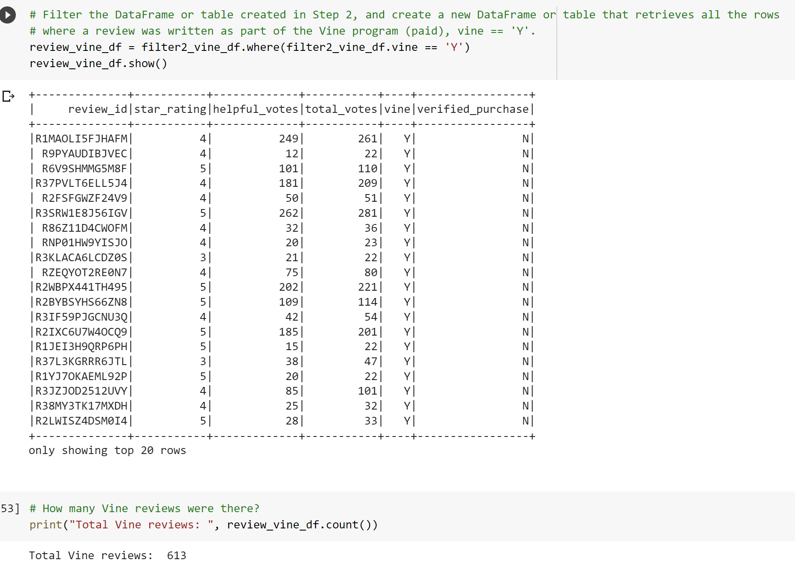
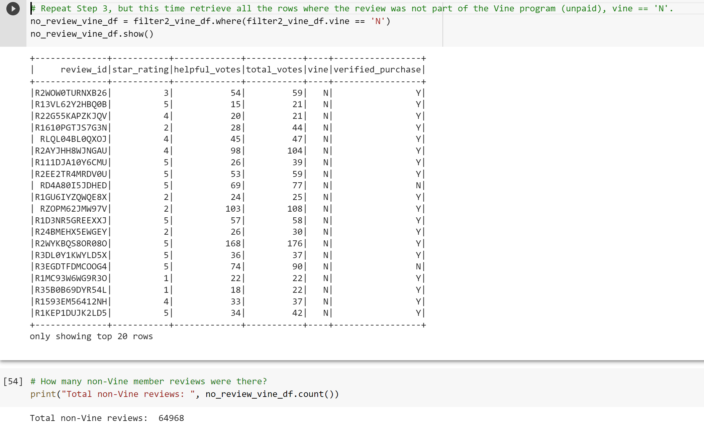
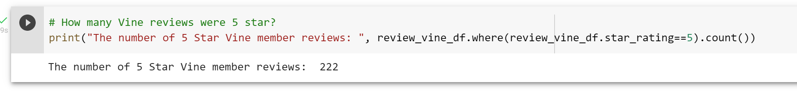
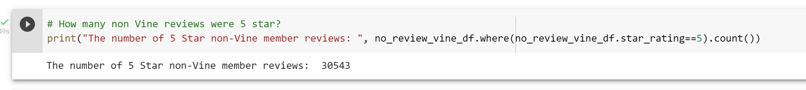

# Amazon_Vine_Analysis

## Overview

The purpose of this project is to analyze Amazon reviews written by members of the paid **Amazon Vine program**, a service that allows manufacturers and publishers to receive reviews of their products and determine if there are any biases between **Vine** members and **Non-Vine** member's reviews. 

Companies will pay a fee to Amazon and may provide free products to Vine members who are then required to publish a review. In order to determine if there is any bias towards favorable reviews from Vine members vs. non-members, we need to identify the percentage of 5 star ratings to total rating. As part of this exercise, we were asked to choose from 50 datasets to extract, transform and load into a dataframe in order to complete our analysis. Throughout this analysis, we use:

* `PySpark` to extract the dataset, transform the data, connect to `AWS RDS` instance and load the transformed data into `pgAdmin`.
* `Google Colaboratory` to import `PySpark` libraries and connect to `Postgres` in order to create `SQL` tables and export the results. 

Of the 50 datasets, I chose to analyze reviews that were made by users in the **"Electronics"** category. This included items such as headphones, phone cases, computers, speakers, etc.

Dataset used for this analysis can be found [here](https://s3.amazonaws.com/amazon-reviews-pds/tsv/amazon_reviews_us_Electronics_v1_00.tsv.gz)

## Analysis

The data set for this analysis originally had over 3 million recorded reviews. The first step is to trim down the dataset into the most useful data to allow for a better analysis. For deliverable one, the data was organzied into four tables and loaded from AWS Relational Databases into pgAdmin as a SQL database. These tables were:

1. Customer ID and Customer Count
2. Product ID and Product Title
3. Review ID, Customer ID, Product ID, Product Parent, and Review Data
4. Review ID, Star Rating, Helpful Votes, Total Votes, Vine, Verified Purchase

The fourth table is referenced as the Vine Table and is the one that was used for the analysis of the 5 star reviews based on if the product was reviewed by a vine member or not. The Vine Table was first reduced to only reviews where there were 20 or more total votes. The data was filtered again for where the helpful votes percentage is greater than 50%. The table was then split into two tables of vine members and non members.

* First Analysis Question: How many Vine reviews and non-Vine reviews were there?

*Figure 1: Screenshot from Google colab showing the vine review dataframe and total count of reviews*

The total number of Vine members leaving reviews is 613. This is a very small percentage of the total number of reviews, which is over 65,000.

*Figure 2: Screenshot from Google colab showing the non-vine member reviews dataframe and total count*

The total number of non-Vine members leaving reviews is 64,968. This is almost the entire data set of reviews! Just in this preliminary analysis, it is clear that the Vine membership is not a significant driver in what leads customers to leave a review.

* Second Analysis Question: How many Vine member and non members reviews were 5 stars?

*Figure 3: Screenshot showing analysis of number of five star reviews for the total reviews by Vine members*

*Figure 3: Screenshot showing analysis of number of five star reviews for the total reviews by non-Vine members*

The images above show there were 222 5-star reviews from Vine members and 30,543 5-star reviews from non-Vine members. These numbers do not tell us a lot on their own but will be used in the next step of the analysis.

* Third Analysis Question: What percentage of Vine reviews were 5 stars? What percentage of non-Vine reviews were 5 stars?

